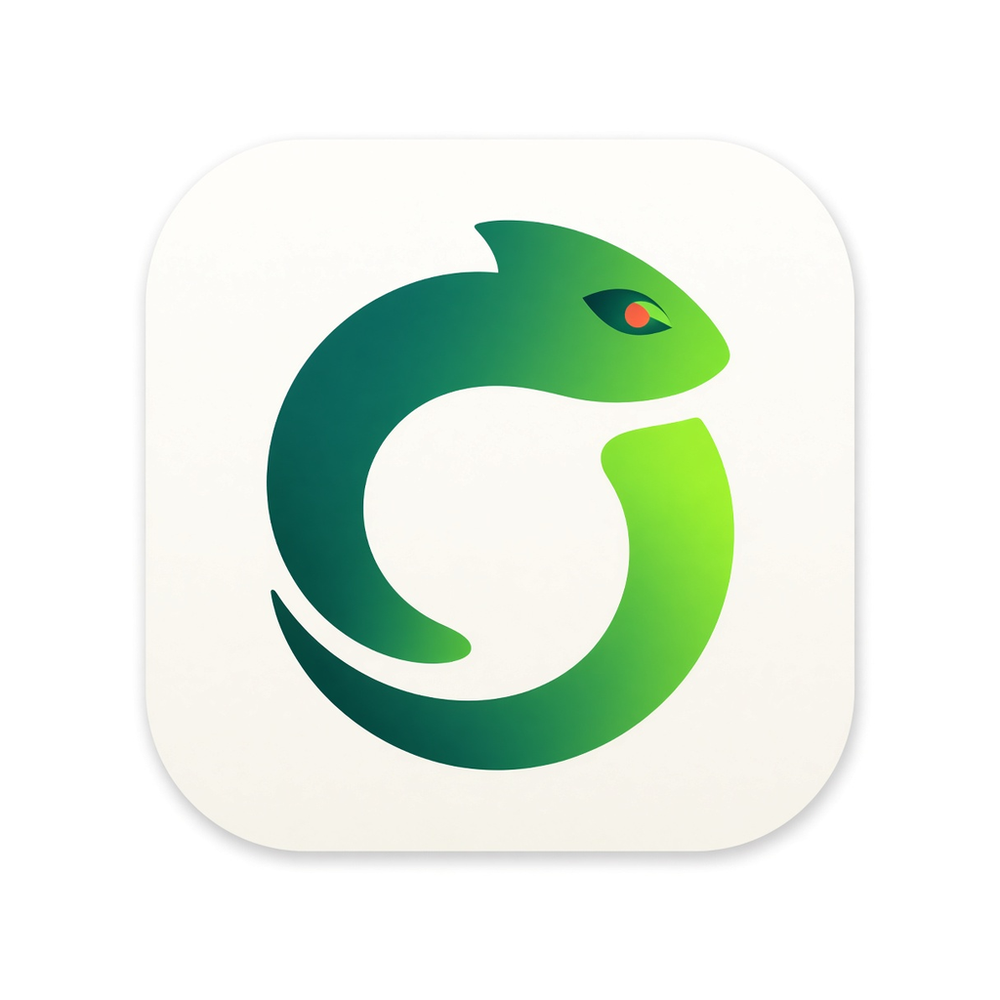
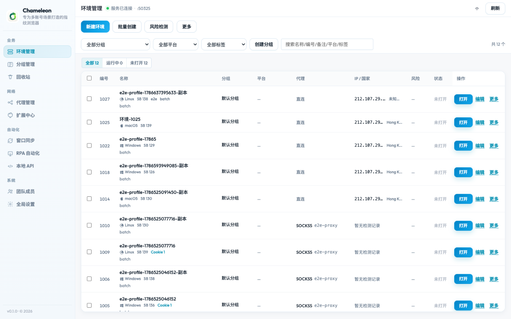
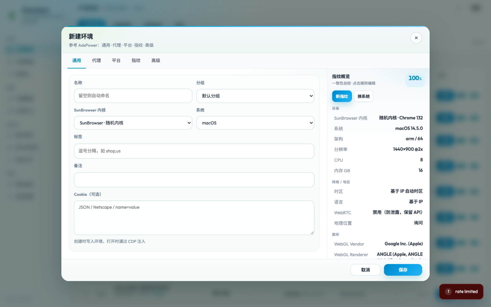
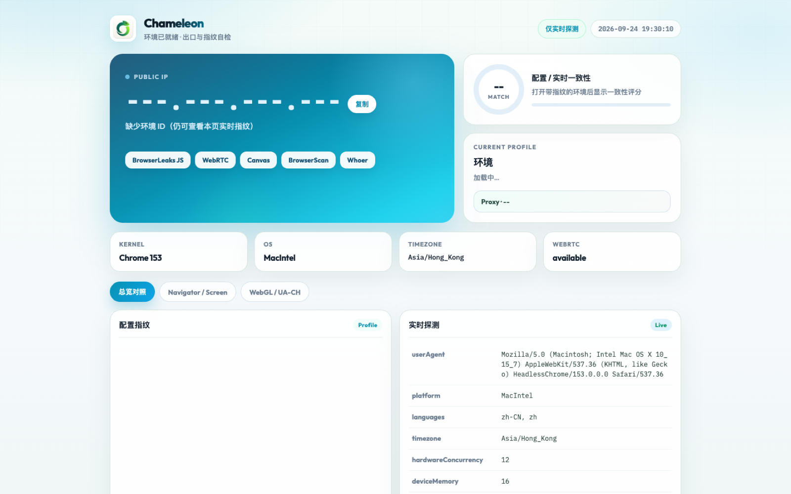
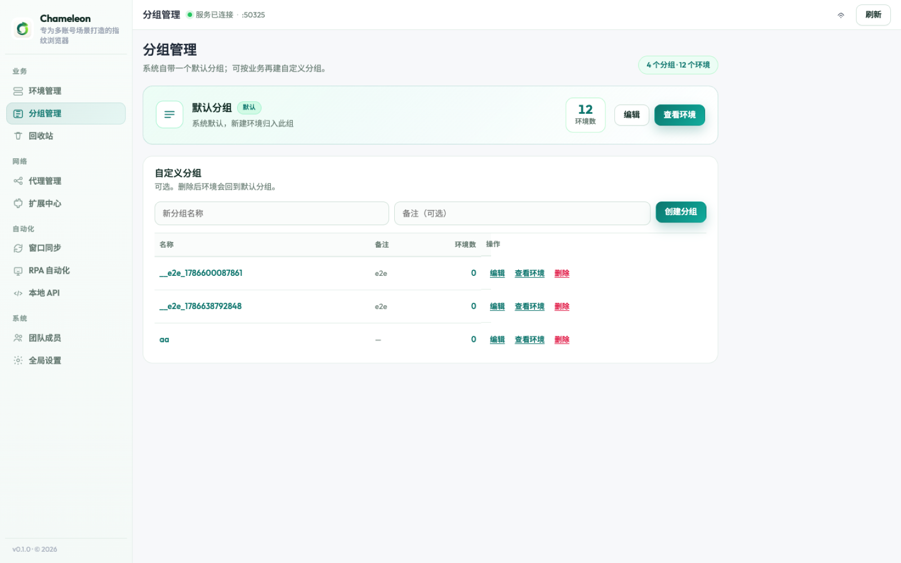
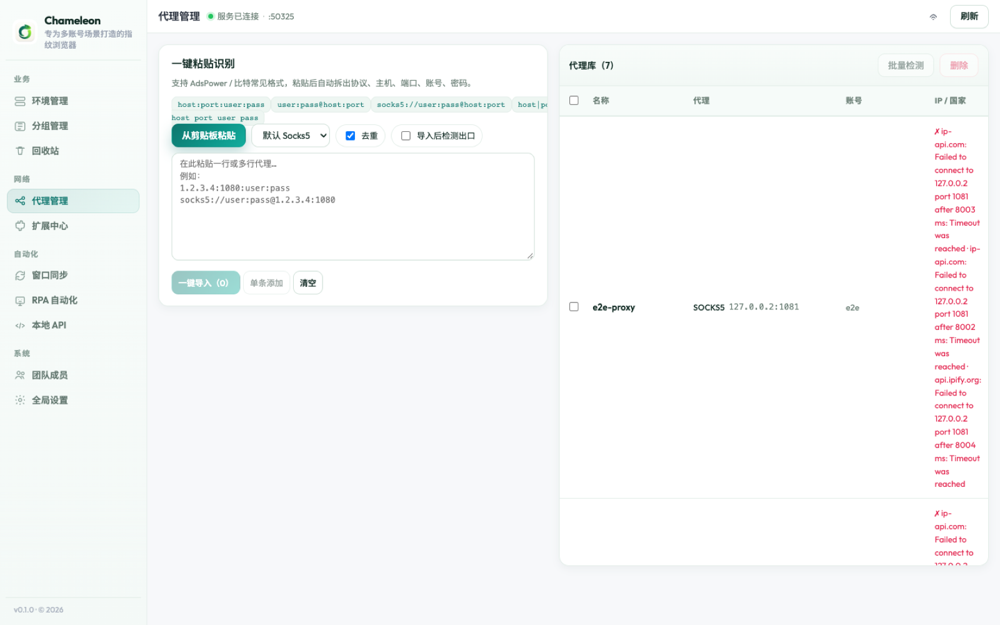

# Chameleon

  

  <strong>专为多账号场景打造的指纹浏览器</strong> 
  Mac 优先 · 独立环境 · 真实一致指纹 · 代理库 · 风险预检

  
  &nbsp;
  

---

## 产品截图

### 环境管理

### 新建环境 · 指纹概览

### 环境启动页

  
  &nbsp;
  

---

## 核心能力

| 模块 | 说明 |
|------|------|
| 环境多开 | 独立 Profile、分组、批量创建、回收站 |
| 指纹引擎 | UA / OS / 屏幕 / WebGL / 硬件一致组合，侧栏一致性概览 |
| 代理库 | 粘贴识别、出口 IP 检测、时区联动 |
| 风险预检 | 环境 / 关联 / 行为三层提示 |
| 启动自检 | 出口 IP、配置 vs 实时指纹对照 |
| Local API | 本地接口，可对接 Playwright / RPA |

---

## 获取软件

- 官网：<https://linux503.github.io/Chameleon/>
- 最新版 v0.2.0（Universal · Apple Silicon + Intel）：
  - [DMG 安装包](https://github.com/linux503/Chameleon/releases/download/v0.2.0/Chameleon-0.2.0-mac-universal.dmg)
  - [ZIP](https://github.com/linux503/Chameleon/releases/download/v0.2.0/Chameleon-0.2.0-mac-universal.zip)
  - [Release 说明](https://github.com/linux503/Chameleon/releases/tag/v0.2.0)
- 支持 / 商务：<https://github.com/linux503/Chameleon/issues>

> **源码不公开。** 本仓库仅提供产品介绍、官网与发行说明。

---

## 系统要求

- macOS 11+（Apple Silicon M 系列 / Intel，Universal 包）
- 本机 Google Chrome

---

## License

商业产品。仓库内文档与官网素材以展示为目的；软件本体授权请通过官方渠道获取。
